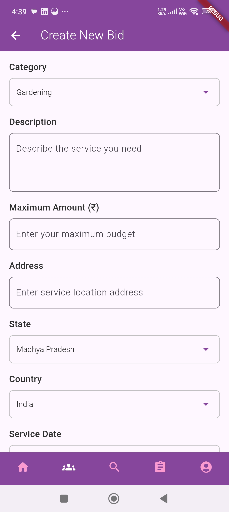

# WorkUp - Freelancing Service Platform

WorkUp is a full-stack application that connects customers with local service providers for various household and professional services. It allows customers to post service requests and receive bids from nearby or interested service providers, offering a seamless and secure experience for both parties.

 <!-- Optional image if available -->

## 🌟 Features

### 🔍 For Customers:
- Browse and request services from nearby providers
- Place custom bids for services
- Real-time chat with service providers after booking
- Track request status and order history
- Secure payment integration

### 💼 For Service Providers:
- Browse and accept relevant service requests
- Place bids for available tasks
- Manage bookings and service history
- In-app chat with customers
- Location-based service requests

## 🛠️ Tech Stack

### Frontend (Mobile):
- **Flutter**: For cross-platform UI
- **Dart**: For frontend logic
- **Google Maps API**: For location services

### Backend:
- **Java** (Spring Boot): REST API for user management, booking, bidding, and chat
- **MongoDB**: NoSQL database for storing user data, bids, orders, and messages
- **Spring Security + JWT**: For authentication and role-based access
- **WebSockets**: For real-time chat functionality

### DevOps:
- **Maven**: Build automation
- **Postman**: API testing
- **Azure / AWS / Render** *(Specify where hosted)*: For deployment

## 📱 Screenshots

<!-- Replace with actual image paths -->
- Home Screen  
- Bid List View  
- Chat Interface  
- Booking History

## 🔐 Authentication & Roles

- Role-based access: Customer vs. Service Provider
- JWT tokens for secure session management
- Password hashing with BCrypt

## 🧩 Project Structure

